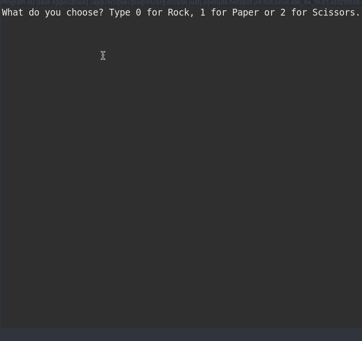

## Rock Paper Scissors Game Java Version

---

Game console made in Java with Eclipse IDE.
 
* This project was made in Eclipse IDE 
* This project relies on internal components to function.

### **Intention**
***
The purpose of this project was to practice Lists and conditionals in Java.

***
### Explanation of the Game
The game asks the user to type 0 for rock, 1 for paper and 2 for scissors.
After the user chooses one of them the program shows the user's choice in the form of an ASCII drawning, then the program shows the choice of CPU and who won the game.

---
### Summary of the Code
This algorithm was made with 1 <b>Class</b>, the main class in java.

* **Class Program**

- Variables:
    - String rock = a String that takes receive the ASCII image for an rock.
    - String paper = a String that takes receive the ASCII image for an paper.
    - String scissors = a String that takes receive the ASCII image for an scissors.
    - List< String > images = a String list tha will receive the images in ASCII.
    - int user_choice = An int with the number chosen by the user will display an ASCII image from the list options.
    - int computer_choice = An int with the number chosen by the CPU will display an ASCII image from the list options.

#### Imports
###### In Program Class
    - import java.util.Arrays;
    - import java.util.List;
    - import java.util.Scanner;

### Conditionals to check a winner

Explanation of the methods used in the algorithm.

##### Class Program
~~~java
if (user_choice >= 3 || user_choice < 0) {
        System.out.println("You typed an invalid number, you lose!");
    }
    else if(user_choice == 0 && computer_choice == 2) {
        System.out.println("You win!");
    }
    else if(computer_choice == 0 && user_choice == 2) {
        System.out.println("You loose!");
    }
    else if(computer_choice > user_choice) {
        System.out.println("You lose!");
    }
    else if(user_choice > computer_choice) {
        System.out.println("You win!");
    }
    else if(user_choice == computer_choice) {
        System.out.println("It's a draw");
    }
~~~
> This conditional structure checks the winner given eah choice between the user and the CPU.  

# Image of Application

# Instalation

Clone this repository in your local machine with the command:

- git clone https://github.com/bywilliams/rock_paper_scissors.git

## Author
***
> William Silva -> [site e portfolio pessoal](https://bywilliams.github.io/site/)

**Thank you for following the documentation and explanation of this little algorithm.**